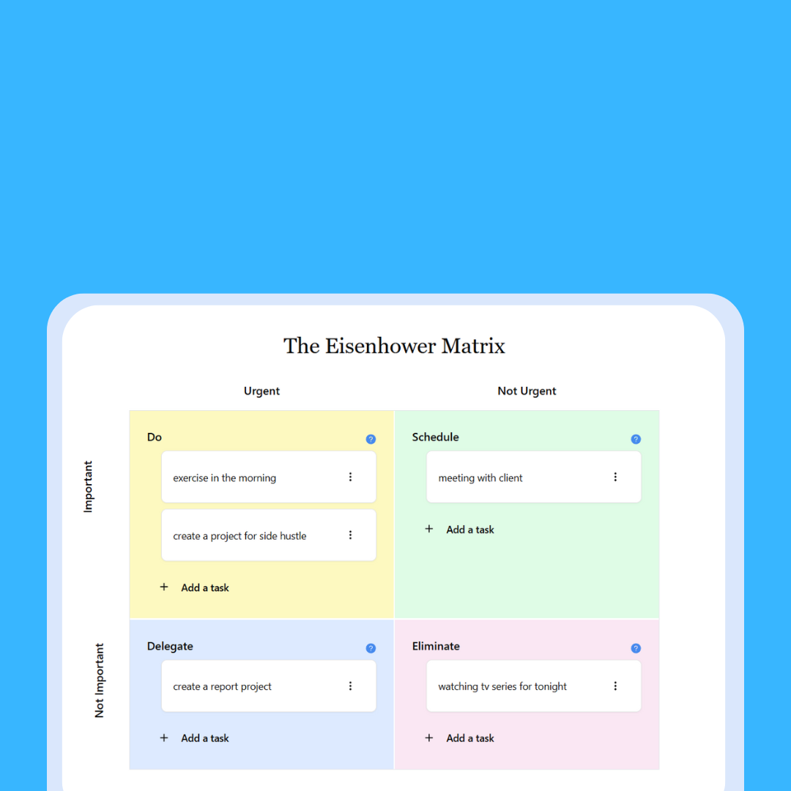

# Eisenhower Matrix Task Manager

A modern web application built with Next.js that implements the Eisenhower Matrix methodology for task management and prioritization.




## Overview

The Eisenhower Matrix (also known as the Urgent-Important Matrix) is a productivity and decision-making tool that helps you organize tasks based on their urgency and importance. The matrix divides tasks into four quadrants:

1. **Do** (Urgent & Important)
   - Tasks that need immediate attention
   - Crisis management
   - Deadline-driven projects

2. **Schedule** (Not Urgent & Important)
   - Strategic planning
   - Personal development
   - Long-term goals

3. **Delegate** (Urgent & Not Important)
   - Interruptions
   - Some meetings
   - Some emails

4. **Eliminate** (Not Urgent & Not Important)
   - Time wasters
   - Some emails
   - Unproductive activities

## Features

- 📱 Responsive design
- 💾 Local storage persistence
- ✏️ Create, update, and delete tasks
- 🎯 Task categorization by urgency and importance

## Tech Stack

- **Framework**: Next.js 14 with App Router
- **State Management**: Redux Toolkit
- **Styling**: Tailwind CSS
- **UI Components**: Shadcn/ui
- **TypeScript**: For type safety

## Getting Started

1. Clone the repository:
```bash
git clone https://github.com/HarisMI40/eisenhowermatrix.git
```

2. Install dependencies:
```bash
npm install
# or
yarn install
```

3. Run the development server:
```bash
npm run dev
# or
yarn dev
```

4. Open [http://localhost:3000](http://localhost:3000) with your browser to see the result.

## Contributing

Contributions are welcome! Please feel free to submit a Pull Request.

## License

This project is licensed under the MIT License - see the LICENSE file for details.
